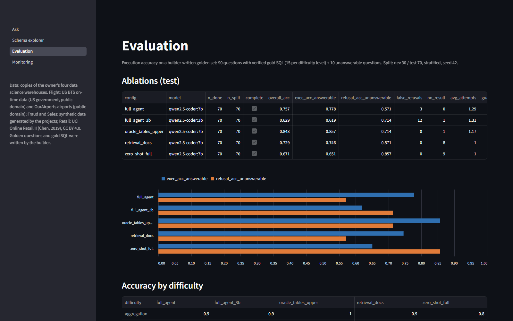

# Text-to-SQL analytics agent over four data science warehouses

**Status: finished.** Test-set evaluations run on 2026-10-02 on the GPU laptop (RTX 3050 Laptop, 4 GB VRAM,
8 GB RAM). **Headline: the full agent (qwen2.5-coder:7b) answers 77.8% of answerable test questions
correctly (49/63) and refuses 4 of 7 unanswerable ones; a zero-shot full-schema baseline gets 65.1%.**




App pages: [Ask](results/screenshots/ask.png) | [Schema explorer](results/screenshots/schema.png) | [Evaluation](results/screenshots/evaluation.png) | [Monitoring](results/screenshots/monitoring.png). Runs fully locally with Ollama; no paid APIs.

## Problem
Business users ask questions like "which airline cancels the most flights in March?" and wait for an
analyst to write SQL. This agent answers plain-English analytics questions about the owner's four data
science projects (flight delays, card fraud, retail churn, sales forecasting). It writes DuckDB SQL with
a small local model, runs it read-only behind guardrails, fixes its own errors, and shows a table, a chart
and a short summary built only from the returned values. It refuses when the data doesn't exist.
It is evaluated by **execution accuracy** on a golden question set.

## Architecture
```
 question
    |
    v
 BM25 schema retrieval (bm25s) over data/catalog.json ------ top 7 tables (chosen on dev)
    |   catalogue = dbt schema.yml descriptions + builder notes + DuckDB types + sample values
    v
 prompt (rules + CREATE TABLE-style schema with comments)
    |
    v
 Ollama qwen2.5-coder:7b / :3b (temperature 0) ---> "CANNOT_ANSWER: ..." -> refusal
    |  SQL
    v
 guardrails (sqlglot): one SELECT/WITH only, no DDL/DML/PRAGMA/ATTACH/COPY/SET/INSTALL,
    |  no file/env functions, schema-qualified known tables only, LIMIT added
    v
 DuckDB data/warehouse.duckdb, read-only, external access off, 30 s timeout, max 1000 rows
    |
    +-- error / guardrail block / empty or all-NULL result --> feed back, retry (max 3)
    v
 answer: table + chart choice (line/bar/table) + summary from the actual values
    |
    v
 SQLite trace (data/traces.db): timings, tokens, every attempt -> Monitoring page
```
Code: `src/` (retrieval, prompts, llm, guardrails, executor, agent, answer, evaluation, tracing,
llm_lock), `scripts/` (pipeline steps and evaluation), `tests/` (pytest), `streamlit_app.py`, `config.yaml`.

## Dataset and licence
- **Warehouse:** copies of the analytics (`warehouse`) schemas of the four DS projects, exported from their
  Postgres containers one stack at a time (`scripts/export_warehouses.py`) into one DuckDB file with a
  schema per project. 22 tables, 2.48M rows; see `data/MANIFEST.csv`. Row counts match Postgres exactly.

  | Schema | Tables | Largest table | Source data and licence |
  |---|---|---|---|
  | flight | 10 | fact_flights 2,240,444 | US BTS on-time performance Jan-Apr 2024 (US government, public domain); OurAirports (public domain) |
  | fraud | 2 | fact_transactions 149,995 | synthetic, generated by the fraud project |
  | retail | 6 | fact_orders 44,870 | UCI Online Retail II (Chen, 2019), CC BY 4.0 |
  | sales | 4 | fact_daily_sales 8,768 | synthetic, generated by the sales project |

  Left out on purpose (ML artefacts, not analytics tables): `flight.mart_flight_features`,
  `flight.flight_cutoff_features`, `flight.model_test_predictions`, `fraud.mart_transaction_features`.
- **Golden set: written by the builder (the developer of this project), not a public benchmark.** No public
  benchmark covers these private warehouses. 90 questions with gold SQL, 15 per difficulty level
  (single table, aggregation, join, window/top-N per group, date logic, multi-step), plus 10 unanswerable
  questions (ticket prices, passengers, credit scores, store locations, ...). **Every gold query was
  executed** against the warehouse and must return a non-empty, non-NULL result
  (`results/golden_verification.csv`). Ties at top-N cut-offs were checked by hand. Split: dev 30 / test 70,
  stratified by difficulty, seed 42 (`data/splits.json`). Prompts and retrieval settings were tuned only
  on dev.

## Setup and run (Windows PowerShell)
**First download the warehouse:** `warehouse.duckdb` (104 MB, over GitHub's file limit) is attached to this
repository's [Releases](../../releases) page. Put it in `data/`. Rebuilding it instead needs the four data
science projects' Postgres databases (`scripts/export_warehouses.py`).

```powershell
cd AI_Engineer_Portfolio\text_to_sql_agent
python -m venv .venv                                  # Python 3.13 or 3.14 (the evaluations ran on 3.14.0)
.venv\Scripts\python -m pip install -r requirements.txt
ollama pull qwen2.5-coder:7b
ollama pull qwen2.5-coder:3b

# Data (already built; only needed to rebuild). Starts ONE DS postgres container at a time, then stops it.
.venv\Scripts\python scripts\export_warehouses.py
.venv\Scripts\python scripts\build_catalog.py
.venv\Scripts\python scripts\build_golden.py
.venv\Scripts\python scripts\retrieval_dev.py          # dev-only choice of top_tables

.venv\Scripts\python -m pytest -q                      # 105 tests, no LLM needed
.venv\Scripts\python scripts\smoke_test.py             # 3 dev questions end to end
.venv\Scripts\streamlit run streamlit_app.py           # http://localhost:8611 : Ask / Schema explorer / Evaluation / Monitoring
```
The model is a setting: `llm.model` in `config.yaml` (or the sidebar in the app).

## How to run the evaluations
On the GPU machine, after copying this folder (including `data/warehouse.duckdb`) and installing as above:
```powershell
cd AI_Engineer_Portfolio\text_to_sql_agent
ollama list                                   # qwen2.5-coder:7b and qwen2.5-coder:3b must be listed
.venv\Scripts\python -m pytest -q             # sanity: all tests pass
# One click (or a Windows Task Scheduler task pointing at this file):
scripts\run_queue_task.cmd
# ...which runs exactly this (equivalent manual command):
.venv\Scripts\python scripts\run_eval_queue.py --split test
```
- The queue runs the 4 ablations one after another on the 70 test questions
  (`zero_shot_full`, `retrieval_docs`, `full_agent_3b`, `full_agent`), scores after each job
  (`scripts/score.py`) and runs `scripts/error_analysis.py` at the end.
- **Resumable:** each question is cached in `results/eval/test__<config>.jsonl`; re-run the same command after
  an interruption. Logs: `results/logs/`.
- It holds `AI_Engineer_Portfolio\.llm_lock` while running. If a crash left a stale lock (the PID in it is not
  running: `tasklist /FI "PID eq <pid>"`), delete the file first.
- Optional upper bound (gold tables given instead of retrieval):
  `.venv\Scripts\python scripts\run_eval_queue.py --split test --jobs oracle_tables_upper`
- Single runs: `.venv\Scripts\python scripts\eval_agent.py --split test --config full_agent`.
- Outputs: `results/summary_test.csv`, `results/by_difficulty_test.csv`, `results/scored/`,
  `results/error_analysis_test.json`. The app's Evaluation page reads them automatically.
- Latency numbers are only meaningful if nothing else heavy runs at the same time.

## Results (test set, 70 questions)
Run once on the test split after all tuning was done on dev (`results/summary_test.csv`). Temperature 0.

| Configuration | What changes | Exec. accuracy (63 answerable) | Refusal accuracy (7 unanswerable) | Overall (70) | Avg attempts | Guardrail blocks | Latency p50 / p95 | Tokens (prompt / completion) |
|---|---|---|---|---|---|---|---|---|
| zero_shot_full | full schema, names + types only; no retrieval, no retries (simple baseline) | 0.651 (41) | 0.857 (6) | 0.671 | 1.00 | 0 | 10.2 s / 27.5 s | 1,809 / 58 |
| retrieval_docs | top-7 tables with descriptions and samples; no retries | 0.746 (47) | 0.571 (4) | 0.729 | 1.00 | 1 | 13.9 s / 34.2 s | 3,495 / 61 |
| **full_agent** | retrieval + docs + up to 3 self-corrections (7B) | **0.778 (49)** | 0.571 (4) | **0.757** | 1.29 | 1 | 14.0 s / 58.6 s | 4,575 / 83 |
| full_agent_3b | same, qwen2.5-coder:3b | 0.619 (39) | 0.714 (5) | 0.629 | 1.31 | 3 | 2.2 s / 7.4 s | 4,647 / 78 |
| oracle_tables_upper (upper bound) | gold tables instead of retrieval, otherwise as full_agent | 0.857 (54) | 0.714 (5) | 0.843 | 1.17 | 1 | 10.0 s / 43.6 s | 1,632 / 78 |

Accuracy by difficulty (`results/by_difficulty_test.csv`; 10-11 questions per level, 7 unanswerable):

| Configuration | Single table | Aggregation | Join | Window / top-N | Date | Multi-step | Unanswerable |
|---|---|---|---|---|---|---|---|
| zero_shot_full | 0.82 | 0.80 | 0.80 | 0.30 | 0.64 | 0.55 | 0.86 |
| retrieval_docs | 1.00 | 0.90 | 0.80 | 0.60 | 0.64 | 0.55 | 0.57 |
| **full_agent** | 1.00 | 0.90 | 0.90 | 0.60 | 0.73 | 0.55 | 0.57 |
| full_agent_3b | 1.00 | 0.90 | 0.30 | 0.50 | 0.64 | 0.36 | 0.71 |
| oracle_tables_upper | 1.00 | 1.00 | 0.90 | 0.70 | 0.91 | 0.64 | 0.71 |

**Reading the results:**
- **Retrieval with column docs is the biggest gain:** +9.5 points on answerable questions over the
  full-schema baseline (41 → 47), on single-table (+2), aggregation (+1) and window/top-N (+3) questions,
  at about twice the prompt tokens.
- **Self-correction adds 2 more questions (47 → 49)** and removes every hallucinated-column error (7 → 0):
  DuckDB's "column not found, candidate bindings: ..." message is enough for the 7B to fix the name. With 63 answerable questions that is within noise
  (the 95% interval at 78% is roughly +/- 10 points), so it is reported as "small, not proven". It is also
  where the p95 latency comes from (58.6 s vs 34.2 s): the slow tail is questions that need retries.
- **Refusal got worse with retrieval (6/7 → 4/7).** With the full schema the 7B sees that nothing fits
  "passengers" or "profit margin"; with only the retrieved tables in view it tends to pick the nearest
  column (e.g. `completed_flights` for passengers). 7 unanswerable questions is a very small sample.
- **Retrieval still costs about 5 questions.** Given exactly the gold query's tables, the same agent gets 54/63
  (0.857) vs 49/63. Retrieval recall was 1.0 on dev, so the gap is mostly the *extra* tables: with 7 tables in
  view the model sometimes picks a pre-aggregated mart instead of the fact table (the wrong-table bucket).
  Window/top-N (0.70) and multi-step (0.64) stay hard even with the right tables, so SQL writing, not
  retrieval, is the larger remaining error source.
- **The 3B is 6.6x faster at p50 but 16 points worse,** mainly on joins (0.30) and multi-step questions, and
  it over-refuses: 12 of its 26 errors are false refusals.

**Latency and hardware:** measured on the GPU laptop, nothing else heavy running except that the AI4 model
downloads (network and disk only) overlapped the first configurations. On a 4 GB GPU, qwen2.5-coder:7b
(5.1 GB loaded) runs split 55% CPU / 45% GPU: about 550 tokens/s prompt processing and 5.3-6.7 tokens/s
generation (short and long prompt, measured with Ollama's own timings). The 3B fits fully on the GPU.
On a GPU with 6 GB or more the 7B latencies would be several times lower.

**Earlier checks (before the test run):**
- Schema retrieval on dev (`results/retrieval_dev.csv`): share of answerable dev questions whose gold-SQL
  tables are all among the retrieved tables: k=3 0.89, k=5 0.93, **k=7 1.00** (schema about 2.1k tokens by a chars/4 estimate; the real 7B prompt in the smoke test was about 3.0k tokens including the instructions),
  k=10 1.00 (about 3.0k tokens). Full schema with docs would be about 6.4k tokens; bare names and types about 1.7k.
- Smoke test (3 dev questions, qwen2.5-coder:7b on the CPU build laptop; `results/smoke_test.json`): 3/3 correct
  with the final prompt. st01 (single table) correct on attempt 1, 346 s; jn03 (3-table join) correct on
  attempt 2 after a self-correction, 439 s; un01 (ticket price, unanswerable) refused on attempt 2 after the
  cross-schema guardrail blocked its first query. With the first prompt, un01 failed: the 7B joined
  `sales.fact_daily_sales` to `flight.dim_carrier` and called `avg_unit_price` a ticket price (kept in
  `results/smoke_test_v1_prompt.json`). Three questions prove the pipeline works; they are not an accuracy
  estimate, and CPU latencies say nothing about the GPU machine.
- In the app, "What is the fraud rate for each channel?" and "Which 5 origin airports have the most total
  weather delay minutes?" were answered correctly by the 7B (values checked against the gold queries).

## Error analysis
`scripts/error_analysis.py` buckets every wrong test answer (rule-based, first match wins), using sqlglot to
compare the predicted SQL with the gold SQL (tables, joins, aggregates, GROUP BY, date functions and
literals). The rules are heuristics, so the examples below were read. Full lists with gold vs. predicted SQL:
`results/error_analysis_test.json`.

| Bucket | zero_shot_full | retrieval_docs | full_agent | full_agent_3b |
|---|---|---|---|---|
| hallucinated column | 8 | 7 | 0 | 1 |
| wrong aggregation | 8 | 2 | 4 | 6 |
| wrong table | 2 | 3 | 4 | 3 |
| false refusal | 0 | 0 | 3 | 12 |
| missed refusal | 1 | 3 | 3 | 2 |
| wrong join | 0 | 2 | 2 | 1 |
| other SQL error | 1 | 1 | 0 | 0 |
| other wrong result | 3 | 1 | 1 | 1 |
| **total wrong (of 70)** | **23** | **19** | **17** | **26** |

The 17 full_agent errors, with real examples:
- **Wrong table (4):** it prefers a pre-aggregated mart when the question needs the fact table. ag05 "average
  arrival delay for each scheduled departure hour" averaged `mart_ontime_by_hour.avg_arr_delay_minutes`
  (an average of averages) instead of `avg(arr_delay_minutes)` over `fact_flights`.
- **Wrong aggregation (4):** mostly "top item per group" questions answered without a window function.
  wn01 "for each month, which carrier had the most cancelled flights?" returned all 60 month-carrier counts
  instead of the 4 winners; wn12 grouped by date and returned 1,000 rows instead of one date per category.
- **False refusal (3):** not the model declining, but the agent giving up: after 3 attempts the query still
  failed (e.g. dt01 used `day_of_week` on a daily mart that lacks it; ms02 invented
  `late_aircraft_delay_minutes`), so the answer was "cannot answer".
- **Missed refusal (3):** the model forced an answer from a nearby column. un02 "how many passengers flew out
  of ATL?" summed `completed_flights`; un07 "profit margin after cost of goods" built a formula from
  `net_revenue` and `return_rate_revenue`. Both then failed to execute, so no wrong number was shown, but the
  agent did not say "this data doesn't exist".
- **Wrong join (2) / other (1):** dt08 put weekend and weekday fraud rates in one row instead of two; wn06
  "3 largest transactions per merchant category" used a global `LIMIT 3` instead of a per-group rank.

## Design decisions
- **Export via `psql` inside each container.** The brief asked that credentials never leave the containers, so
  the export runs `docker compose exec postgres sh -c 'psql -U "$POSTGRES_USER" ...'` and streams CSV to the host.
  The `.env` files are never read. (BUILD_SPEC mentioned parquet and reading `.env`; the instruction not to
  touch credentials takes priority.) The CSVs are loaded with types mapped from Postgres `information_schema`,
  then deleted. Only the postgres service was started, one stack at a time, and stopped afterwards.
- **DuckDB, read-only, external access disabled.** Even a query that slipped past the guardrails cannot
  read files or write. A memory limit (1 GB) and 4 threads keep it friendly to the 8 GB laptop.
- **BM25 rather than embeddings for schema retrieval.** 22 tables; names, descriptions and sample values
  carry the signal and BM25 needs no model download. k=7 was chosen on dev only (recall 1.0).
- **Builder notes complement dbt.** The dbt `schema.yml` files describe tables and tests but few columns, so
  `data/column_notes.yaml` adds column meanings taken from the dbt model SQL (e.g. "rates are fractions",
  "transaction_dow 0 = Sunday", "day_of_week 1 = Monday"). accepted_values tests are included as allowed values.
- **Prompt v2 (dev-only change, from the smoke test on dev question un01):** the four schemas are unrelated, so
  the prompt forbids cross-schema joins and substituting a different measure, and the guardrails block any
  query that mixes schemas (no gold query needs one). Two parser bugs found at the same time were fixed: an
  unterminated quote raised sqlglot's TokenError (now a guardrail rejection), and a refusal wrapped in a
  ```sql fence is now read as a refusal.
- **Self-correction triggers:** execution error, guardrail block, missing SQL, and suspicious results
  (no rows or only NULLs). An empty result after the last retry is returned as is.
- **Summary without an LLM.** The answer text is generated from the result table with templates, so it
  cannot contain invented numbers and costs no extra model call.
- **Comparator:** order-insensitive unless the question asks for an order; columns matched by values, not
  names or positions; extra predicted columns allowed (a name next to a code is still a correct answer);
  floats within 0.1% relative; **whole-number counts must match exactly** (a self-test showed that a
  relative tolerance accepted `COUNT(*) + 1` on large counts); midnight timestamps equal dates.
  Fractions and percentages are not equal (0.25 vs 25), so questions say which they want where it matters.
- **Unanswerable questions** are correct only when the agent refuses; refusing an answerable question counts
  as wrong (false refusal is reported separately).
- **Ollama at 127.0.0.1:11434, no mock fallback.** If Ollama is down the app shows a clear error.
- **Upper bound:** an optional oracle-tables configuration gives the model the gold query's tables, which
  isolates retrieval errors from SQL-writing errors.

## Limitations
- The golden set is written by the builder, who also wrote the prompt rules and the column notes, so the
  phrasing may suit the agent better than real users' questions would. 70 test questions give wide
  confidence intervals (about +/- 11 points at 60% accuracy).
- Execution accuracy can be fooled by a wrong query that happens to return the right values, and can mark
  a reasonable alternative reading of an ambiguous question as wrong.
- Two of the four warehouses are synthetic data.
- Retrieval is lexical; questions using words that appear nowhere in the catalogue may miss tables.

## Next steps
- Top-N-per-group is the weakest category (0.60): a dev-tuned few-shot example of `rank() OVER (PARTITION BY ...)`
  and a prompt rule to prefer fact tables over marts for averages would target the two largest error buckets.
- Few-shot examples from dev questions, and value-aware retrieval (match question words to column values).
- A larger, externally written question set (e.g. colleagues' questions) to reduce builder bias.

## Runs on an 8 GB laptop
- Warehouse file: about 109 MB. The app keeps one read-only DuckDB connection (memory limit 1 GB).
- App RAM (Streamlit process, excluding Ollama), measured on the build laptop: 65 MB working set at start;
  after two questions about 180 MB working set / 515 MB private (peak working set 191 MB).
- The model runs in Ollama: qwen2.5-coder:7b needs about 5 GB, :3b about 2 GB. On 8 GB, close Docker and other
  AI projects while using the 7B, or switch to the 3B in the sidebar.
